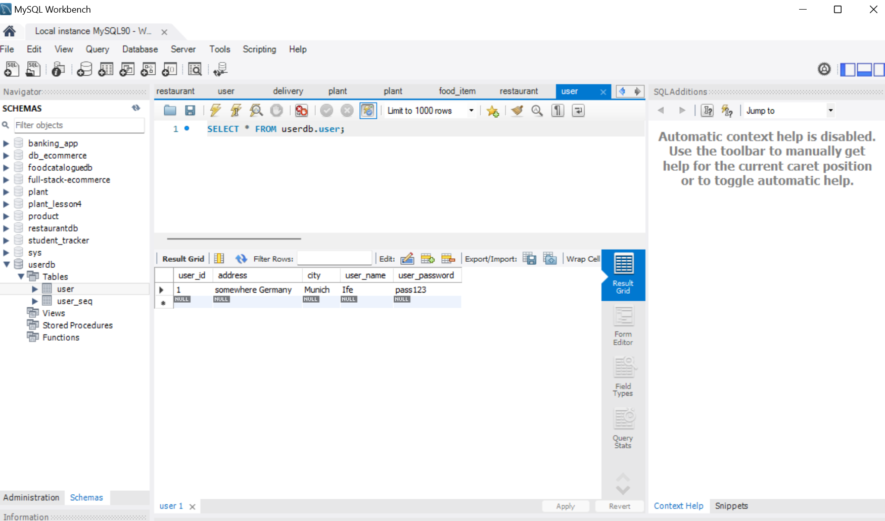
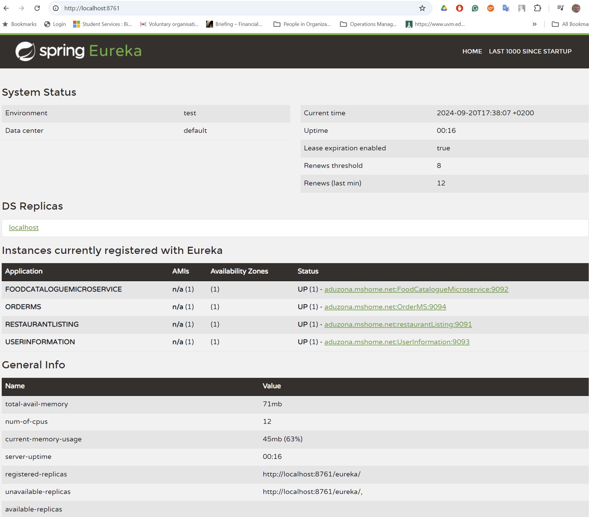
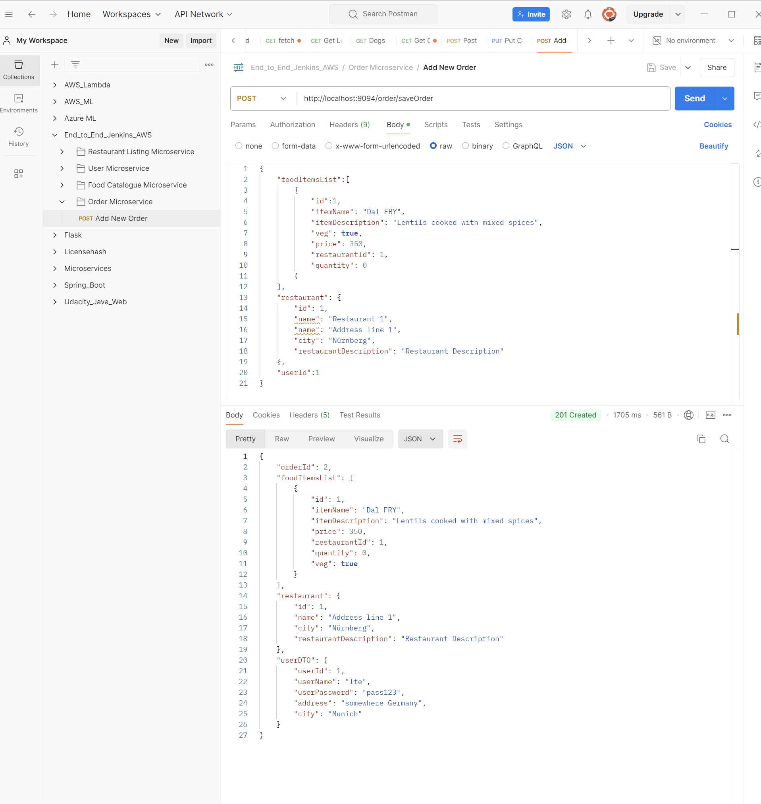
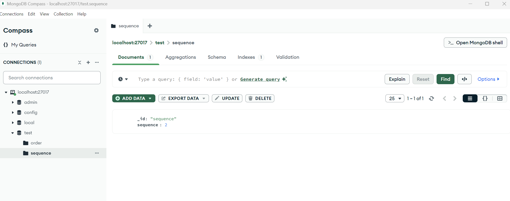
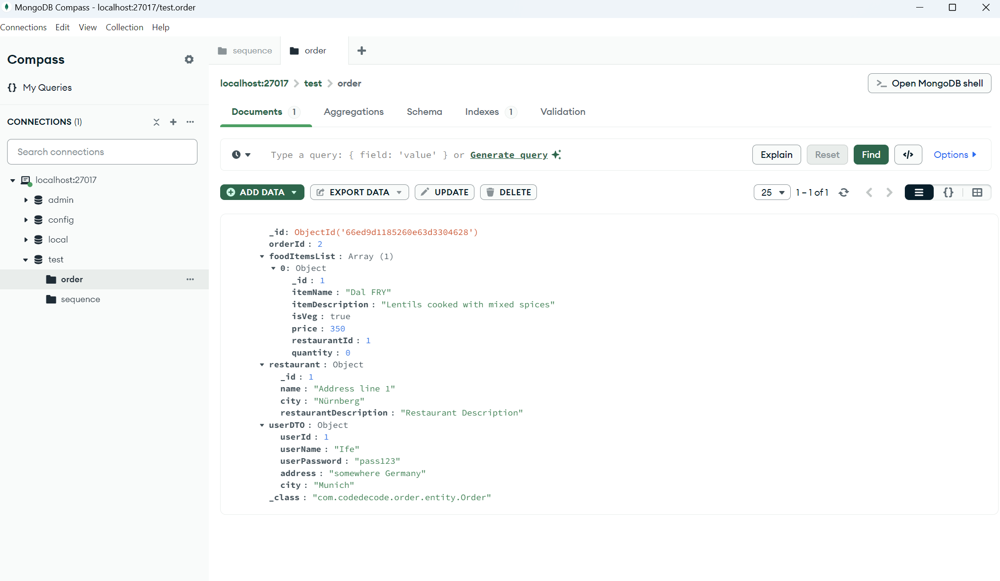

# Introduction

This project demonstrates the creation, deployment, and testing of a microservices-based application using several modern development and deployment tools. The application consists of a **Restaurant Listing** microservice, **User** Microservice, **Food Catalogue** Microservice, **Order** Microservice and an **Eureka server** for service discovery. The project uses Spring Boot for building the services, MySQL as the database, and various cloud-native and DevOps tools for deployment.

Also Included is Frontend Angular and Typescript

[Code links](https://github.com/orgs/udemy-dev-withK8s-AWS-codedecode/repositories)

View our Google Slides presentation: [click here to visit presentation](https://docs.google.com/presentation/d/10yM2esLSyXUrY0qOuR9-JfoXwm9UEMRbVYDnAC9-fVM/edit?usp=sharing)

## Building Backend Microservice Application

* Set Up Eureka Server First.
  * Use Spring Initializr
  * Dependencies
    * Eureka Server
* Then Create Restaurant Listing Microservices:
  * mapstruct used to map your entities to DTOs and DTOs to entities because in real world you will never play with entities.
  * Use spring initializr
  * Dependencies:
    * Spring Web
    * Lombak
    * Spring Data JPA
    * MySQL Driver
    * Eureka Discovery Client
    * We will add mapstruct manually.


Note: `Eureker` server has to start before starting this one `restaurantlisting` microservice

in  database-platform: `org.hibernate.dialect.MySQL5InnoDBDialect` `dialect` converts ORM based language to mySQL based Querry. 

* create restaurantdb in mysql workbench:   
```sql
CREATE SCHEMA `restaurantdb`;
```

* Run Eureka server in a seperate Intellij IDE.
* run Restaurantlisting in another Intellij IDE.

The `MySQL5InnoDBDialect` has been deprecated and removed in recent versions of Hibernate. You should use a more current dialect like `MySQLDialect` or `MySQL8Dialect`.

2 Tables where created in mySQL:
* `restaurant`
* `restaurant_seq`
Also, discovery client created: `DiscoveryClient_RESTAURANTLISTING/host.docker.internal:restaurantListing:9091: registering service...`

Go to the url, `localhost:8761` and see Eureka amd RESTAURANT-SERVICE which is registered.

in `localhost:8761`:


| Application|	AMIs|	Availability Zones|	Status|
|---|---|---|---|
|RESTAURANTLISTING|	n/a (1)|	(1)|	UP (1) - host.docker.internal:restaurantListing:9091|


Then we add more endpoints to the controller:

Now try to save a restaurant using `POST` in path: `http://localhost:9091/restaurant/addRestaurant`

```json
{
    "name": "Restaurant 1",
    "address": "Address line 1",
    "city": "Nürnberg",
    "restaurantDescription":"Restaurant Description"
}
```

I got `201 Created` and it returned:
```json
{
    "id": 1,
    "name": "Restaurant 1",
    "address": "Address line 1",
    "city": "Nürnberg",
    "restaurantDescription": "Restaurant Description"
}
```

* next test the GET request:  `http://localhost:9091/restaurant/fetchById/1`
* Also test GET request: `http://localhost:9091/restaurant/fetchAllRestaurants`

### Eureka Server

**Directory Structure:**
```
.
|-- HELP.md
|-- mvnw
|-- mvnw.cmd
|-- pom.xml
|-- src
|   |-- main
|   |   |-- java
|   |   |   -- com
|   |   |       -- codedecode
|   |   |           -- eureka
|   |   |               -- EurekaApplication.java
|   |   -- resources
|   |       |-- application.properties
|   |       -- application.yml
|   -- test
|       -- java
|           -- com
|               -- codedecode
|                   -- eureka
|                       -- EurekaApplicationTests.java
-- target
    |-- classes
    |   |-- application.properties
    |   |-- application.yml
    |   -- com
    |       -- codedecode
    |           -- eureka
    |               -- EurekaApplication.class
    -- generated-sources
        -- annotations
```

**`@EnableEurekaServer` Annotation**

- **Purpose:** The `@EnableEurekaServer` annotation is used to make your Spring Boot application act as a Eureka server. Eureka is a service discovery server, which allows microservices to register themselves at runtime and discover other services for communication.
- **Functionality:** When you annotate your main class with `@EnableEurekaServer`, Spring Boot sets up the necessary configurations and starts a Eureka server when your application runs.

```java
@SpringBootApplication
@EnableEurekaServer
public class EurekaApplication {
    public static void main(String[] args) {
        SpringApplication.run(EurekaApplication.class, args);
    }
}
```

**`application.yml` in Eureka Server**

- **`server.port`:** Sets the port on which the Eureka server will run (e.g., 8761).
- **`eureka.client.fetch-registry` & `eureka.client.register-with-eureka`:** Both set to `false` because this application itself is the Eureka server, so it doesn’t need to fetch a registry or register with another Eureka server.

```yaml
server:
  port: 8761

eureka:
  client:
    fetch-registry: false
    register-with-eureka: false
```

**`pom.xml` in Eureka Server**

- **Dependencies:**
  - **`spring-cloud-starter-netflix-eureka-server`:** Includes all the necessary components to create a Eureka server.
  - **`spring-boot-starter-test`:** Used for writing and running tests.

- **Properties:** Specifies the Java version and Spring Cloud version for compatibility.

```xml
<project xmlns="http://maven.apache.org/POM/4.0.0" xmlns:xsi="http://www.w3.org/2001/XMLSchema-instance"
    xsi:schemaLocation="http://maven.apache.org/POM/4.0.0 https://maven.apache.org/xsd/maven-4.0.0.xsd">
    <modelVersion>4.0.0</modelVersion>
    <parent>
        <groupId>org.springframework.boot</groupId>
        <artifactId>spring-boot-starter-parent</artifactId>
        <version>3.3.3</version>
        <relativePath/> 
    </parent>
    <groupId>com.codedecode</groupId>
    <artifactId>eureka</artifactId>
    <version>0.0.1-SNAPSHOT</version>
    <name>Eureka</name>
    <description>Demo project for Spring Boot Eureka server</description>
    <properties>
        <java.version>22</java.version>
        <spring-cloud.version>2023.0.3</spring-cloud.version>
    </properties>
    <dependencies>
        <dependency>
            <groupId>org.springframework.cloud</groupId>
            <artifactId>spring-cloud-starter-netflix-eureka-server</artifactId>
        </dependency>
        <dependency>
            <groupId>org.springframework.boot</groupId>
            <artifactId>spring-boot-starter-test</artifactId>
            <scope>test</scope>
        </dependency>
    </dependencies>
    <dependencyManagement>
        <dependencies>
            <dependency>
                <groupId>org.springframework.cloud</groupId>
                <artifactId>spring-cloud-dependencies</artifactId>
                <version>${spring-cloud.version}</version>
                <type>pom</type>
                <scope>import</scope>
            </dependency>
        </dependencies>
    </dependencyManagement>
    <build>
        <plugins>
            <plugin>
                <groupId>org.springframework.boot</groupId>
                <artifactId>spring-boot-maven-plugin</artifactId>
            </plugin>
        </plugins>
    </build>
</project>
```

### Restaurant Listing Microservice

**Directory Structure:**
```
.
|-- HELP.md
|-- mvnw
|-- mvnw.cmd
|-- pom.xml
|-- src
|   |-- main
|   |   |-- java
|   |   |   -- com
|   |   |       -- codedecode
|   |   |           -- restaurantlisting
|   |   |               |-- RestaurantListingApplication.java
|   |   |               |-- controller
|   |   |               |   -- RestaurantController.java
|   |   |               |-- dto
|   |   |               |   -- RestaurantDTO.java
|   |   |               |-- entity
|   |   |               |   -- Restaurant.java
|   |   |               |-- mapper
|   |   |               |   -- RestaurantMapper.java
|   |   |               |-- repo
|   |   |               |   -- RestaurantRepo.java
|   |   |               -- service
|   |   |                   -- RestaurantService.java
|   |   -- resources
|   |       |-- application.properties
|   |       |-- application.yml
|   |       |-- static
|   |       -- templates
|   -- test
|       -- java
|           -- com
|               -- codedecode
|                   -- restaurantlisting
|                       -- RestaurantListingApplicationTests.java
-- target
    |-- classes
    |   |-- application.properties
    |   |-- application.yml
    |   -- com
    |       -- codedecode
    |           -- restaurantlisting
    |               |-- RestaurantListingApplication.class
    |               |-- controller
    |               |   -- RestaurantController.class
    |               |-- dto
    |               |   -- RestaurantDTO.class
    |               |-- entity
    |               |   -- Restaurant.class
    |               |-- mapper
    |               |   |-- RestaurantMapper.class
    |               |   -- RestaurantMapperImpl.class
    |               |-- repo
    |               |   -- RestaurantRepo.class
    |               -- service
    |                   -- RestaurantService.class
    -- generated-sources
        -- annotations
            -- com
                -- codedecode
                    -- restaurantlisting
                        -- mapper
                            -- RestaurantMapperImpl.java
```


**`RestaurantMapper.java`**

`RestaurantMapper.java` is an interface that defines methods for mapping between different object types, specifically between `RestaurantDTO` and `Restaurant` objects.

- **Purpose:** The primary purpose of this mapper is to convert data between the `Restaurant` entity, which represents the data model tied to the database, and `RestaurantDTO`, which is used for transferring data in a controlled manner between layers, typically from your service layer to the controller and vice versa.

- **Key Components:**
  - **MapStruct Annotation (`@Mapper`):** This tells the MapStruct library that this interface will be used to generate the implementation of the mapping methods at compile time.
  - **Instance (`RestaurantMapper INSTANCE`):** This is a singleton instance of the mapper, which can be used throughout your application.
  - **Mapping Methods:** These methods, `mapRestaurantDTOToRestaurant` and `mapRestaurantToRestaurantDTO`, define the conversion logic between `RestaurantDTO` and `Restaurant`.

```java
@Mapper
public interface RestaurantMapper {
    RestaurantMapper INSTANCE = Mappers.getMapper(RestaurantMapper.class);

    Restaurant mapRestaurantDTOToRestaurant(RestaurantDTO restaurantDTO);
    RestaurantDTO mapRestaurantToRestaurantDTO(Restaurant restaurant);
}
```

**`RestaurantDTO.java`**

`RestaurantDTO.java` is a Data Transfer Object (DTO) that represents the data structure sent between client and server.

- **Purpose:** DTOs are used to encapsulate data and send it over the network. In this case, `RestaurantDTO` contains fields such as `id`, `name`, `address`, `city`, and `restaurantDescription`, representing the essential data of a restaurant that can be exposed to the client.

- **Annotations:**
  - **`@Data`:** This is a Lombok annotation that automatically generates boilerplate code like getters, setters, `toString()`, `equals()`, and `hashCode()` methods.
  - **`@AllArgsConstructor`:** Generates a constructor with all the fields in the class.
  - **`@NoArgsConstructor`:** Generates a no-argument constructor.

```java
@Data
@AllArgsConstructor
@NoArgsConstructor
public class RestaurantDTO {
    private int id;
    private String name;
    private String address;
    private String city;
    private String restaurantDescription;
}
```

**`RestaurantService.java`**

`RestaurantService.java` is a service class that contains the business logic for handling restaurant data.

- **Purpose:** This service handles the core business operations related to restaurants, such as finding all restaurants, adding a new restaurant to the database, and fetching a restaurant by its ID. It interacts with the `RestaurantRepo` to perform these operations on the database.

- **Key Components:**
  - **`@Service`:** Marks the class as a service, a component in the Spring framework, which is used to hold business logic.
  - **Dependency Injection (`@Autowired`):** Injects the `RestaurantRepo` dependency, which is an interface extending `JpaRepository`, to interact with the database.
  - **Methods:**
    - `findAllRestaurants()`: Retrieves all restaurants from the database and maps them to `RestaurantDTO`.
    - `addRestaurantInDB()`: Saves a new restaurant to the database by mapping a `RestaurantDTO` to a `Restaurant` entity.
    - `fetchRestaurantById()`: Fetches a restaurant by its ID and returns it as a `RestaurantDTO`.

```java
@Service
public class RestaurantService {

    @Autowired
    RestaurantRepo restaurantRepo;

    public List<RestaurantDTO> findAllRestaurants(){
        List<Restaurant> restaurants = restaurantRepo.findAll();
        List<RestaurantDTO> restaurantDTOList = restaurants.stream()
                .map(RestaurantMapper.INSTANCE::mapRestaurantToRestaurantDTO)
                .collect(Collectors.toList());
        return restaurantDTOList;
    }

    public RestaurantDTO addRestaurantInDB(RestaurantDTO restaurantDTO) {
        Restaurant savedRestaurant = restaurantRepo.save(RestaurantMapper.INSTANCE.mapRestaurantDTOToRestaurant(restaurantDTO));
        return RestaurantMapper.INSTANCE.mapRestaurantToRestaurantDTO(savedRestaurant);
    }

    public ResponseEntity<RestaurantDTO> fetchRestaurantById(Integer id){
        Optional<Restaurant> restaurant = restaurantRepo.findById(id);
        return restaurant.map(value -> 
                new ResponseEntity<>(RestaurantMapper.INSTANCE.mapRestaurantToRestaurantDTO(value), HttpStatus.OK))
                .orElseGet(() -> new ResponseEntity<>(null, HttpStatus.NOT_FOUND));
    }
}
```

**`Restaurant.java`**

`Restaurant.java` is an entity class that maps to a database table.

- **Purpose:** This class represents the `Restaurant` entity, which is directly tied to the database table `restaurant`. Each instance of this class corresponds to a row in the table.

- **Annotations:**
  - **`@Entity`:** Marks the class as a JPA entity.
  - **`@Id`:** Denotes the primary key field.
  - **`@GeneratedValue(strategy = GenerationType.AUTO)`:** Specifies that the ID should be generated automatically.

- **Fields:** These correspond to the columns in the `restaurant` table: `id`, `name`, `address`, `city`, and `restaurantDescription`.

```java
@Entity
@Data
@AllArgsConstructor
@NoArgsConstructor
public class Restaurant {

    @Id
    @GeneratedValue(strategy = GenerationType.AUTO)
    private int id;
    private String name;
    private String address;
    private String city;
    private String restaurantDescription;
}
```

**`RestaurantController.java`**

`RestaurantController.java` is a REST controller that handles HTTP requests.

- **Purpose:** This controller exposes endpoints to manage restaurant data, such as creating a new restaurant, fetching all restaurants, and fetching a restaurant by its ID. It serves as the entry point for client interactions with the application.

- **Annotations:**
  - **`@RestController`:** Marks the class as a controller where every method returns a domain object instead of a view. It's a combination of `@Controller` and `@ResponseBody`.
  - **`@RequestMapping("/restaurant")`:** Maps HTTP requests to the controller’s methods.
  - **`@CrossOrigin`:** Enables cross-origin resource sharing (CORS) support.

- **Key Methods:**
  - `fetchAllRestaurants()`: Handles GET requests to retrieve all restaurants.
  - `saveRestaurant()`: Handles POST requests to add a new restaurant.
  - `findRestaurantById()`: Handles GET requests to retrieve a restaurant by ID.

```java
@RestController
@RequestMapping("/restaurant")
@CrossOrigin
public class RestaurantController {

    @Autowired
    RestaurantService restaurantService;

    @GetMapping("/fetchAllRestaurants")
    public ResponseEntity<List<RestaurantDTO>> fetchAllRestaurants(){
        List<RestaurantDTO> allRestaurants = restaurantService.findAllRestaurants();
        return new ResponseEntity<>(allRestaurants, HttpStatus.OK);
    }

    @PostMapping("/addRestaurant")
    public ResponseEntity<RestaurantDTO> saveRestaurant(@RequestBody RestaurantDTO restaurantDTO) {
        RestaurantDTO restaurantAdded = restaurantService.addRestaurantInDB(restaurantDTO);
        return new ResponseEntity<>(restaurantAdded, HttpStatus.CREATED);
    }

    @GetMapping("fetchById/{id}")
    public ResponseEntity<RestaurantDTO> findRestaurantById(@PathVariable Integer id) {
        return restaurantService.fetchRestaurantById(id);
    }
}
```

**Repository Interface (`RestaurantRepo.java`):**
```java
package com.codedecode.restaurantlisting.repo;

import com.codedecode.restaurantlisting.entity.Restaurant;
import org.springframework.data.jpa.repository.JpaRepository;
import org.springframework.stereotype.Repository;

@Repository
public interface RestaurantRepo extends JpaRepository<Restaurant, Integer> {
}
```

**Application Class (`RestaurantListingApplication.java`):**
```java
package com.codedecode.restaurantlisting;

import org.springframework.boot.SpringApplication;
import org.springframework.boot.autoconfigure.SpringBootApplication;

@SpringBootApplication
public class RestaurantListingApplication {
    public static void main(String[] args) {
        SpringApplication.run(RestaurantListingApplication.class, args);
    }
}
```

**MapStruct**

MapStruct is a Java annotation processor used for generating type-safe, performant, and easy-to-use mappers for converting between Java objects (like DTOs and entities). It automatically generates the implementation of mapper interfaces at compile-time, avoiding the need for repetitive and error-prone manual mapping code.

**Advantages:**
- **Type Safety:** Ensures the mappings are type-safe and checked at compile time.
- **Performance:** Since the mapping code is generated at compile time, it’s faster than using reflection-based mappers.
- **Less Boilerplate Code:** Reduces the amount of code needed to convert between different types.


**`application.yml` in Restaurant Listing Microservice**

The `application.yml` file is the main configuration file for a Spring Boot application. It allows you to define various properties in a hierarchical, structured format.

**Key Sections:**
- **`server.port`:** Specifies the port on which the microservice will run (e.g., 9091).
- **`eureka.client.service-url.defaultZone`:** Configures the URL for the Eureka server, which the microservice will use for registration and discovery.
- **`spring.datasource`:** Defines the database connection settings like URL, username, password, and driver class.
- **`spring.jpa.hibernate.ddl-auto`:** Specifies the behavior of the database schema creation (e.g., `update` to update the schema automatically).
- **`spring.jpa.show-sql`:** Enables the logging of SQL statements generated by Hibernate.
- **`spring.jpa.database-platform`:** Defines the Hibernate dialect to use for the MySQL database (`MySQL8Dialect`).

```yaml
server:
  port: 9091

eureka:
  client:
    service-url:
      defaultZone: http://localhost:8761/eureka/

spring:
  application:
    name: RESTAURANT-SERVICE
  datasource:
    url: jdbc:mysql://localhost:3306/restaurantdb
    username: ""
    password: ""
    driver-class-name: com.mysql.cj.jdbc.Driver
  jpa:
    hibernate:
      ddl-auto: update
    show-sql: true
    database-platform:

 org.hibernate.dialect.MySQL8Dialect
```


**`pom.xml` in Restaurant Listing Microservice**

The `pom.xml` (Project Object Model) is the core configuration file for a Maven project. It defines dependencies, plugins, and project-specific details like the Java version.

**Key Sections:**
- **`parent`:** Inherits common configurations from `spring-boot-starter-parent`.
- **`dependencies`:** Includes all necessary dependencies like `spring-boot-starter-data-jpa`, `spring-boot-starter-web`, `spring-cloud-starter-netflix-eureka-client`, and database connector `mysql-connector-j`.
- **`properties`:** Defines project properties like `java.version` and `spring-cloud.version`.
- **`build.plugins`:** Configures the Maven build process, including the Spring Boot Maven plugin for packaging the application.

```xml
<project xmlns="http://maven.apache.org/POM/4.0.0" xmlns:xsi="http://www.w3.org/2001/XMLSchema-instance"
    xsi:schemaLocation="http://maven.apache.org/POM/4.0.0 https://maven.apache.org/xsd/maven-4.0.0.xsd">
    <modelVersion>4.0.0</modelVersion>
    <parent>
        <groupId>org.springframework.boot</groupId>
        <artifactId>spring-boot-starter-parent</artifactId>
        <version>3.3.3</version>
        <relativePath/> 
    </parent>
    <groupId>com.codedecode</groupId>
    <artifactId>restaurantlisting</artifactId>
    <version>0.0.1-SNAPSHOT</version>
    <name>restaurantListing</name>
    <description>Demo project for Spring Boot Restaurant Listing App</description>
    <properties>
        <java.version>22</java.version>
        <spring-cloud.version>2023.0.3</spring-cloud.version>
    </properties>
    <dependencies>
        <dependency>
            <groupId>org.springframework.boot</groupId>
            <artifactId>spring-boot-starter-data-jpa</artifactId>
        </dependency>
        <dependency>
            <groupId>org.springframework.boot</groupId>
            <artifactId>spring-boot-starter-web</artifactId>
        </dependency>
        <dependency>
            <groupId>org.springframework.cloud</groupId>
            <artifactId>spring-cloud-starter-netflix-eureka-client</artifactId>
        </dependency>
        <dependency>
            <groupId>com.mysql</groupId>
            <artifactId>mysql-connector-j</artifactId>
            <scope>runtime</scope>
        </dependency>
        <dependency>
            <groupId>org.mapstruct</groupId>
            <artifactId>mapstruct</artifactId>
            <version>1.5.5.Final</version>
        </dependency>
        <dependency>
            <groupId>org.projectlombok</groupId>
            <artifactId>lombok</artifactId>
            <optional>true</optional>
        </dependency>
        <dependency>
            <groupId>org.springframework.boot</groupId>
            <artifactId>spring-boot-starter-test</artifactId>
            <scope>test</scope>
        </dependency>
    </dependencies>
    <dependencyManagement>
        <dependencies>
            <dependency>
                <groupId>org.springframework.cloud</groupId>
                <artifactId>spring-cloud-dependencies</artifactId>
                <version>${spring-cloud.version}</version>
                <type>pom</type>
                <scope>import</scope>
            </dependency>
        </dependencies>
    </dependencyManagement>
    <build>
        <plugins>
            <plugin>
                <groupId>org.springframework.boot</groupId>
                <artifactId>spring-boot-maven-plugin</artifactId>
            </plugin>
        </plugins>
    </build>
</project>
```


**Database Setup**

Create the MySQL database schema using the following SQL command:

```sql
CREATE SCHEMA `restaurantdb`;
```

This will create the required schema for your application.

**Service Registration and Eureka Dashboard**

- Start the Eureka server and the RestaurantListing microservice.
- Navigate to `http://localhost:8761` to view the Eureka dashboard.
- You should see the `RESTAURANTLISTING` service registered and UP.


#### Summary

- **`RestaurantMapper.java`:** Converts between `RestaurantDTO` and `Restaurant` using MapStruct.
- **`RestaurantDTO.java`:** Data Transfer Object for transferring restaurant data between client and server.
- **`RestaurantService.java`:** Contains business logic for handling restaurants, including database interactions.
- **`Restaurant.java`:** Entity class representing the `restaurant` table in the database.
- **`RestaurantController.java`:** REST controller that exposes endpoints to manage restaurant data.
- **MapStruct:** A tool for generating mapping code between objects at compile time.
- **`application.yml`:** Configuration file for setting application properties in a structured manner.
- **`pom.xml`:** Maven configuration file that defines project dependencies, build configuration, and plugins.
- **`@EnableEurekaServer`:** Annotation that turns a Spring Boot application into a Eureka server for service discovery.


#### Testing Endpoints

1. **Add a Restaurant (POST Request):**

   URL: `http://localhost:9091/restaurant/addRestaurant`

   **Request Body:**
   ```json
   {
       "name": "Restaurant 1",
       "address": "Address line 1",
       "city": "Nürnberg",
       "restaurantDescription": "Restaurant Description"
   }
   ```

   **Expected Response:**
   ```json
   {
       "id": 1,
       "name": "Restaurant 1",
       "address": "Address line 1",
       "city": "Nürnberg",
       "restaurantDescription": "Restaurant Description"
   }
   ```

2. **Fetch Restaurant by ID (GET Request):**

   URL: `http://localhost:9091/restaurant/fetchById/1`

   **Expected Response:**
   ```json
   {
       "id": 1,
       "name": "Restaurant 1",
       "address": "Address line 1",
       "city": "Nürnberg",
       "restaurantDescription": "Restaurant Description"
   }
   ```

3. **Fetch All Restaurants (GET Request):**

   URL: `http://localhost:9091/restaurant/fetchAllRestaurants`

   **Expected Response:**
   ```json
   [
       {
           "id": 1,
           "name": "Restaurant 1",
           "address": "Address line 1",
           "city": "Nürnberg",
           "restaurantDescription": "Restaurant Description"
       }
   ]
   ```


### User Details Microservice


This Microservice handles user information like its id, name, password,  address where to deliver the food etc. 


Tech stack used 

* Microservice architecture
* Rest APIs
* Java 22
* MySql Relational DB as Datasource
* Spring Boot 
* Lombok
* Eureka Client
* mapstruct

Generate from start.spring.io:
* Project: Mavin
* Language: Java
* Spring Boot: 3.3.3
* Project Metadata
  * Group: com.codedecode
  * Artifact: userinfo
  * Name: UserInformation
  * Description: Demo project for Spring Boot User Details MS
  * Package name: com.codedecode.userinfo
  * Packaging: Jar
  * Java: 22
* Dependencies:
  * Lombok
  * Spring Web
  * Spring Data JPA
  * MySQL Driver
  * Eureka Discovery Client
  * Later add MapStruct
* Generate

in pom.xml, add MapStruct
```xml
...
        <dependency>
			<groupId>org.mapstruct</groupId>
			<artifactId>mapstruct</artifactId>
			<version>1.5.5.Final</version>
		</dependency>
```

in build, add plugin for mapstruct

```xml
...
        <plugin>
				<groupId>org.apache.maven.plugins</groupId>
				<artifactId>maven-compiler-plugin</artifactId>
				<version>3.8.1</version>
				<configuration>
					<annotationProcessorPaths>
						<path>
							<groupId>org.projectlombok</groupId>
							<artifactId>lombok</artifactId>
							<version>1.18.34</version>
						</path>
						<path>
							<groupId>org.mapstruct</groupId>
							<artifactId>mapstruct-processor</artifactId>
							<version>1.5.5.Final</version>
						</path>

					</annotationProcessorPaths>
				</configuration>
			</plugin>
```


Packages:

* controller
* dto
* entity
* repo
* service
* mapper

For Application.yml: 

* server port: 9093 . Please note different ports for different microservices.
* Configure Eureka client
* Application name configuration.
* Link to user database

Make sure you `CREATE SCHEMA userdb;`

```yml
server:
  port: 9093

eureka:
  client:
    service-url:
      defaultZone: http://localhost:8761/eureka/

spring:
  profiles:
    active: dev
  application:
    name: USER-SERVICE
  datasource:
    url: jdbc:mysql://localhost:3306/userdb
    password: ""
    username: ""
    driver-class-name: com.mysql.cj.jdbc.Driver
  jpa:
    hibernate:
      ddl-auto: update
    show-sql: true
    database-platform: org.hibernate.dialect.MySQL8Dialect
```

Run Eureka server in a seperate IDE, then run Then run the application.

Test in Postman was successful.
Run `http://localhost:8761/`and see if Microservices are registered successfully. This was registered successfully.

Data saved


Please note, there was no Hashing and Salting done to this password stored in the database. And passwords used was random thus a placehoder before Hashing and salting is applied.


### Food Catalogue Listing

On Front end page where all restaurants are listed , when we select 1 restaurant, Ll its food menu is shown. Also restaurant details , address etc too is shown. 

* Food Catalogue Microservice is responsible to-
    * List **all food items list of that particular Restaurant** and 
    * **Complete Restaurant Details** too on the front end Page / UI


Tech stack used 

* Microservice architecture
* Rest APIs
* Java 22
* MySql Relational DB as Datasource
* Spring Boot 
* Lombok
* Eureka Client
* mapstruct

Generate from start.spring.io:
* Project: Mavin
* Language: Java
* Spring Boot: 3.3.3
* Project Metadata
  * Group: com.codedecode
  * Artifact: userinfo
  * Name: UserInformation
  * Description: Demo project for Spring Boot User Details MS
  * Package name: com.codedecode.userinfo
  * Packaging: Jar
  * Java: 22
* Dependencies:
  * Lombok
  * Spring Web
  * Spring Data JPA
  * MySQL Driver
  * Eureka Discovery Client
  * Later add MapStruct
* Generate


Packages:

* controller
* dto
* entity
* repo
* service
* mapper


in `pom.xml`, add Mapstruct and plugind
s
```xml
    <dependency>
			<groupId>org.mapstruct</groupId>
			<artifactId>mapstruct</artifactId>
			<version>1.5.5.Final</version>
		</dependency>

    ...

    <plugin>
				<groupId>org.apache.maven.plugins</groupId>
				<artifactId>maven-compiler-plugin</artifactId>
				<version>3.8.1</version>
				<configuration>
					<annotationProcessorPaths>
						<path>
							<groupId>org.projectlombok</groupId>
							<artifactId>lombok</artifactId>
							<version>1.18.34</version>
						</path>
						<path>
							<groupId>org.mapstruct</groupId>
							<artifactId>mapstruct-processor</artifactId>
							<version>1.5.5.Final</version>
						</path>

					</annotationProcessorPaths>
				</configuration>
			</plugin>
```

in `FoodItem.java`. Quantity of the food item is initialized zero, as when you enter a supermarket, you have not selected a quantity.

```java
package com.codedecode.foodcatalogue.entity;

import jakarta.persistence.*;
import lombok.AllArgsConstructor;
import lombok.Data;
import lombok.NoArgsConstructor;

@Entity
@Data
@NoArgsConstructor
@AllArgsConstructor
public class FoodItem {

    @Id
    @GeneratedValue(strategy = GenerationType.AUTO)
    private int id;

    private String itemName;

    private String itemDescription;

    private  boolean isVeg;

    private Number price;

    private  Integer restaurantId;

    @Column(nullable = false, columnDefinition = "INT DEFAULT 0")
    private Integer quantity;
}

```

In DTO package, create `FoodItemDTO.java` which is our Data Transfer object for the entity FoodItem.java.

`FoodItemDTO.java`
```java
package com.codedecode.foodcatalogue.dto;


import lombok.AllArgsConstructor;
import lombok.Data;
import lombok.NoArgsConstructor;

@Data
@AllArgsConstructor
@NoArgsConstructor
public class FoodItemDTO {

    private int id;

    private String itemName;

    private String itemDescription;

    private  boolean isVeg;

    private Number price;

    private  Integer restaurantId;
    private Integer quantity;
}

```


Also create a restaurant DTO in `Foodcatalogue Microservice` which will be used to fetch response from `Restaurant` entity's `restaurantlisting microservice`

So this is a data transfer from restaurant microservice to food catalogue microservice.
`Restaurant.java`
```java
package com.codedecode.foodcatalogue.dto;

import lombok.AllArgsConstructor;
import lombok.Data;
import lombok.NoArgsConstructor;

@Data
@AllArgsConstructor
@NoArgsConstructor
public class Restaurant {
    
    private int id;
    private String name;
    private String address;
    private String city;
    private String restaurantDescription;
}

```


next `FoodCataloguePage.java`
Responsible for showing all the food Item list and restaurant details on the frontend.

```java
package com.codedecode.foodcatalogue.dto;

import com.codedecode.foodcatalogue.entity.FoodItem;
import lombok.AllArgsConstructor;
import lombok.Data;
import lombok.NoArgsConstructor;

import java.util.List;

@Data
@NoArgsConstructor
@AllArgsConstructor


public class FoodCataloguePage {

    private List<FoodItem> foodItemsList;

    private Restaurant restaurant;
}

```

Mapper

Mapping between FoodItem.java and FoodItemDTO.java
`FoodItemMapper.java`
```java
package com.codedecode.foodcatalogue.mapper;

import com.codedecode.foodcatalogue.dto.FoodItemDTO;
import com.codedecode.foodcatalogue.entity.FoodItem;
import org.mapstruct.Mapper;
import org.mapstruct.factory.Mappers;

@Mapper
public interface FoodItemMapper {

    FoodItemMapper INSTANCE = Mappers.getMapper(FoodItemMapper.class);

    FoodItem mapFoodItemDTOToFoodItem(FoodItemDTO foodItemDTO);

    FoodItemDTO mapFoodItemToFoodItemDto(FoodItem foodItem);
}

```

To fetch a retaurant details from another microservice, we need a rest template.
so got to `FoodCatalogueMicroserviceApplication`
create `@Bean`. Assuming we have 3 instances making  request, which of these three should this rest template go and hit and get our data, so it should be `@LoadBalanced`, because there can be multiple instances of the `restaurantlisting` microservice.

Now `Eureka` will find the instance that is not so busy and is available to quickly respond your request. 

make sure you `Autowired` `RestTemplate` in `FoodCatalogueService.java`


`FoodCatalogueMicroserviceApplication`
```java
package com.codedecode.foodcatalogue;

import org.springframework.boot.SpringApplication;
import org.springframework.boot.autoconfigure.SpringBootApplication;
import org.springframework.cloud.client.loadbalancer.LoadBalanced;
import org.springframework.context.annotation.Bean;
import org.springframework.web.client.RestTemplate;

@SpringBootApplication
public class FoodCatalogueMicroserviceApplication {

	public static void main(String[] args) {
		SpringApplication.run(FoodCatalogueMicroserviceApplication.class, args);
	}

	@Bean
	@LoadBalanced
	public RestTemplate getRestTemplate(){
		return new RestTemplate();
	}
}

```


The `restaurantlisting` runs at port `9091` at `fetchById/{id}` path apply in `fetchRestaurantDetailsFromRestaurantMS`, 
But we are going to use the `restaurantlisting` Microservice name in `application.yml` which is `RESTAURANTLISTING`. So create url in a load balanced way.

also in `fetchRestaurantDetailsFromRestaurantMS(Integer restaurantId)` we use getForObject,to get info for url: `"http://RESTAURANTLISTING/restaurant/fetchById/"+restaurantId` and map it to the retaurant DTO in our application. 
`FoodCatalogueService.java`
```java
package com.codedecode.foodcatalogue.service;

import com.codedecode.foodcatalogue.dto.FoodCataloguePage;
import com.codedecode.foodcatalogue.dto.FoodItemDTO;
import com.codedecode.foodcatalogue.dto.Restaurant;
import com.codedecode.foodcatalogue.entity.FoodItem;
import com.codedecode.foodcatalogue.mapper.FoodItemMapper;
import com.codedecode.foodcatalogue.repo.FoodItemRepo;
import org.springframework.beans.factory.annotation.Autowired;
import org.springframework.stereotype.Service;
import org.springframework.web.client.RestTemplate;

import java.util.List;

@Service
public class FoodCatalogueService {

    @Autowired
    FoodItemRepo foodItemRepo;

    @Autowired
    RestTemplate restTemplate;//LoadBalanced restTemplate

    public FoodItemDTO addFoodItem(FoodItemDTO foodItemDTO) {
        FoodItem foodItemSavedInDB= foodItemRepo.save(FoodItemMapper.INSTANCE.mapFoodItemDTOToFoodItem(foodItemDTO));
        return  FoodItemMapper.INSTANCE.mapFoodItemToFoodItemDto(foodItemSavedInDB);
    }

    public FoodCataloguePage fetchFoodCataloguePageDetails(Integer restaurantId) {

        // We need 2 things
        // food item list
        List<FoodItem> foodItemList = fetchFoodItemList(restaurantId);

        //restaurantdetails
        Restaurant restaurant = fetchRestaurantDetailsFromRestaurantMS(restaurantId);

        return createFoodCataloguePage(foodItemList,restaurant);


    }

    /**
     * Merge 2 responses from fetchRestaurant...() and fetchFoodItemList(..) as
     * one food catalog page
     * @param foodItemList
     * @param restaurant
     */
    private FoodCataloguePage createFoodCataloguePage(List<FoodItem> foodItemList, Restaurant restaurant) {
        FoodCataloguePage foodCataloguePage =new FoodCataloguePage();
        foodCataloguePage.setFoodItemsList(foodItemList);
        foodCataloguePage.setRestaurant(restaurant);
        return foodCataloguePage;
    }

    /**
     * Goes to the restaurantlisting microservice and get details
     * @param restaurantId
     * @return
     */
    private Restaurant fetchRestaurantDetailsFromRestaurantMS(Integer restaurantId) {
        return restTemplate.getForObject("http://RESTAURANTLISTING/restaurant/fetchById/"+restaurantId,Restaurant.class);//As seen in Eureka, RESTAURANTLISTING.  Eureka will figure this path out.

    }

    /**
     * Go hit the database and get the list of food items of a restaurant
     * @param restaurantId
     * @return
     */
    private List<FoodItem> fetchFoodItemList(Integer restaurantId) {
        return foodItemRepo.findByRestaurantId(restaurantId);
    }
}

```

in controller package
`FoodCatalogueController.java`
```java
package com.codedecode.foodcatalogue.controller;

import com.codedecode.foodcatalogue.dto.FoodCataloguePage;
import com.codedecode.foodcatalogue.dto.FoodItemDTO;
import com.codedecode.foodcatalogue.repo.FoodItemRepo;
import com.codedecode.foodcatalogue.service.FoodCatalogueService;
import org.springframework.beans.factory.annotation.Autowired;
import org.springframework.http.HttpStatus;
import org.springframework.http.ResponseEntity;
import org.springframework.web.bind.annotation.*;

@RestController
@RequestMapping("/foodCatalogue")
public class FoodCatalogueController {

    @Autowired
    FoodCatalogueService foodCatalogueService;


    @PostMapping("/addFoodItem")
    public ResponseEntity<FoodItemDTO> addFoodItem(@RequestBody FoodItemDTO foodItemDTO){
        FoodItemDTO foodItemSaved = foodCatalogueService.addFoodItem(foodItemDTO);
        return new ResponseEntity<>(foodItemSaved, HttpStatus.CREATED);
    }

    @GetMapping("/fetchRestaurantAndFoodItemsById/{restaurantId}")
    public ResponseEntity<FoodCataloguePage> fetchRestaurantDetailsWithFoodMenu(@PathVariable Integer restaurantId){
        FoodCataloguePage foodCataloguePage = foodCatalogueService.fetchFoodCataloguePageDetails(restaurantId);
        return new ResponseEntity<>(foodCataloguePage,HttpStatus.OK);
    }
}

```


in application.yml
```yml
server:
  port: 9092

eureka:
  client:
    service-url:
      defaultZone: http://localhost:8761/eureka/

spring:
  profiles:
    active: dev
  application:
    name: FOOD-CATALOGUE-SERVICE
  datasource:
    url: jdbc:mysql://localhost:3306/foodcataloguedb
    password: ""
    username: ""
    driver-class-name: com.mysql.cj.jdbc.Driver
  jpa:
    hibernate:
      ddl-auto: update
    show-sql: true
    database-platform: org.hibernate.dialect.MySQL8Dialect
```

Create a database:
```sql
CREATE database foodcataloguedb;
```

Then run, start the Eureka server first, then  run foodcatalogue microservice.

Check mysql workbench, you will see 2 tables there. `food_item`and `food_item_seq`

Go to eureka server's `localhost:8761`then check for registered service.


You will see `FOODCATALOGUEMICROSERVICE`.

#### Testing

Go to postman and add items.
1. POST: `http://localhost:9092/foodCatalogue/addFoodItem`

```json
{
    "itemName": "Dal Fry",
    "itemDescription": "Lentils cooked with mixed spices",
    "veg": true,
    "price": 350,
    "restaurantId": 1,
    "quantity": 0

}
```

It was a success.

2. GET: `http://localhost:9092/foodCatalogue/fetchRestaurantAndFoodItemsById/1`

Output:

```json
{
    "foodItemsList": [
        {
            "id": 1,
            "itemName": "Dal Fry",
            "itemDescription": "Lentils cooked with mixed spices",
            "price": 350,
            "restaurantId": 1,
            "quantity": 0,
            "veg": true
        }
    ],
    "restaurant": {
        "id": 1,
        "name": "Restaurant 1",
        "address": "Address line 1",
        "city": "Nürnberg",
        "restaurantDescription": "Restaurant Description"
    }
}
```

### Order Microservice


**Tech Stack**

* When we Hit OrderNow button,  the order details and user id reached backed, This MS  saves all order details like 
  * Food items list
  * Restaurant details
  * User Information

* Tech stack used 

  * Microservice architecture
  * Rest APIs
  * Java 23
  * Mongo DB as Datasource
  * Spring Boot
  * Lombok
  * Eureka Client

Note we changed datasource to mongoDB
* Install MongoDB and Compass.
* Compass is one way of seeing all the documents in your MongoDB connection.

Order MS

All will have order id as key
* Restaurant Detals
* User Details
* Food Item list

If we are using relational database,
* We will join , user_id, restaurant id, with order id, this will seem complecated.
* But in mongodb, its simpler.
You can have one big document nosql doc, a JSON document, where:

```json
{
  order id: 1
  restaurant {
    rid
    desc
  }
  food item {}
  user detail {}
}
```
  * So no foreign key, 
  * no joins.
  * no need to maintain multiple tables.

Project : Maven

Spring Boot: 3.3.4

Packaging: Jar

Java: 23

Dependencies:
  * Lombok
  * Spring Web
  * Spring Data MongoDB
  * Eureka Discovery Client


Packages:
* controller
* dto
* entity
* repo
* service

Create a dto that we will be getting from the `frontend` and from the `user details microservice`

This will be the exact DTO `RestaurantDTO ` as the `restaurantlisting` microservice.

Restaurant.java:
```java
package com.codedecode.order.dto;

import lombok.AllArgsConstructor;
import lombok.Data;
import lombok.NoArgsConstructor;

@Data
@AllArgsConstructor
@NoArgsConstructor
public class Restaurant {
    private int id;
    private String name;
    private String city;
    private String restaurantDescription;
}

```

Next, we need the list of food Items.
Should be exactly similar to `foodcatalogue Microservice` DTO.


These 3 DTOs are saved in the database which are:  FoodItemDTO is the list coming from the frontend, the Restaurant  DTO and userDTO.


OrderDTO comming from frontend.

```java
package com.codedecode.order.dto;

import lombok.AllArgsConstructor;
import lombok.Data;
import lombok.NoArgsConstructor;

import java.util.List;

@Data
@AllArgsConstructor
@NoArgsConstructor
public class OrderDTO {

    private List<FoodItemsDTO> foodItemsList;
    private Integer userId;
    private Restaurant restaurant;

}

```

We need tp generate the order ID automatically and save it in the MongoDB document. But now MongoDB does not generate sequence table like MySQL., so create a sequence generator for each order saved.

In the `entity` package, the only thing we need to save it Order. and it is going to be saved with orderId.

We need `@Document("order")` for mongodb.
We will also have restaurant information and UserDTO as well.

3 inner JSONS:
```java
private List<FoodItemsDTO> foodItemsList;
    private Restaurant restaurant;
    private UserDTO userDTO;

```

```java
package com.codedecode.order.entity;

import com.codedecode.order.dto.FoodItemsDTO;
import com.codedecode.order.dto.Restaurant;
import com.codedecode.order.dto.UserDTO;
import lombok.AllArgsConstructor;
import lombok.Data;
import lombok.NoArgsConstructor;
import org.springframework.data.mongodb.core.mapping.Document;

import java.util.List;

@Data
@AllArgsConstructor
@NoArgsConstructor
@Document("order")
public class Order {
    private  Integer orderId;
    private List<FoodItemsDTO> foodItemsList;
    private Restaurant restaurant;
    private UserDTO userDTO;

}

```

**repo**

Lets start creating repositories, mongo repository:

```java
package com.codedecode.order.repo;

import com.codedecode.order.entity.Order;
import org.springframework.data.mongodb.repository.MongoRepository;
import org.springframework.stereotype.Repository;

@Repository
public interface OrderRepo extends MongoRepository<Order,Integer> {
}

```

**service**

**controller**

OrderDTO does not contain user information, so we rename this `OrderDTO`to `OrderDTOFromFE` thus From FrontEnd.

Now we need a orderDTO that is going to return when exact order is saved in the DB.
So we create `OrderDTO` which is true replication of Order.java in entity.
continue `controller`:

What we are getting from frontend are here: `OrderDTOFromFE orderDetails`, next, save in DB.

```java
package com.codedecode.order.controller;

import com.codedecode.order.dto.OrderDTO;
import com.codedecode.order.dto.OrderDTOFromFE;
import com.codedecode.order.service.OrderService;
import org.springframework.beans.factory.annotation.Autowired;
import org.springframework.http.HttpStatus;
import org.springframework.http.ResponseEntity;
import org.springframework.web.bind.annotation.PostMapping;
import org.springframework.web.bind.annotation.RequestBody;
import org.springframework.web.bind.annotation.RequestMapping;
import org.springframework.web.bind.annotation.RestController;

@RestController
@RequestMapping("/order")
public class OrderController {

    @Autowired
    OrderService orderService;

    @PostMapping("/saveOrder")
    public ResponseEntity<OrderDTO> saveOrder(@RequestBody OrderDTOFromFE orderDetails){
        OrderDTO orderSavedInDB =orderService.saveOrderInDb(orderDetails);
        return  new ResponseEntity<>(orderSavedInDB, HttpStatus.CREATED);
    }
}

```
Next add list of items and restaurant  from OrderDTOFromFE.

Create entity Sequence:

``Sequence.java`:
```java
package com.codedecode.order.entity;

import lombok.AllArgsConstructor;
import lombok.Data;
import lombok.NoArgsConstructor;
import org.springframework.data.annotation.Id;
import org.springframework.data.mongodb.core.mapping.Document;

@Document(collection = "sequence")
@Data
@AllArgsConstructor
@NoArgsConstructor
public class Sequence {
    @Id
    private String id;
    private int sequence;
}

```

Now we need `SequenceGenerator.java`.

```java
package com.codedecode.order.service;

import com.codedecode.order.entity.Sequence;
import org.springframework.beans.factory.annotation.Autowired;
import org.springframework.data.mongodb.core.FindAndModifyOptions;
import org.springframework.data.mongodb.core.MongoOperations;
import org.springframework.data.mongodb.core.query.Query;
import org.springframework.data.mongodb.core.query.Update;
import org.springframework.stereotype.Service;
import static org.springframework.data.mongodb.core.query.Criteria.where;


@Service
public class SequenceGenerator {

    @Autowired
    MongoOperations mongoOperations;

    public int generateNextOrderId(){
        Sequence counter= mongoOperations.findAndModify(
                Query.query(where("_id").is("sequence")),
                new Update().inc("sequence", 1),
                FindAndModifyOptions.options().returnNew(true).upsert(true),
                Sequence.class
        );
        return  counter.getSequence();
    }
}

```

findAndModify takes 4 things: 
* Query, 
* Update which is the sequence key in sequence entity, 
* Options, the modified documents has to be returned
* Entity class which is the sequence.

Not, `generateNextOrderId` gets sequence id.
see the powerpoint. 

Now in `OrderService`:

```java

package com.codedecode.order.service;

import com.codedecode.order.dto.OrderDTO;
import com.codedecode.order.dto.OrderDTOFromFE;
import com.codedecode.order.dto.UserDTO;
import com.codedecode.order.entity.Order;
import com.codedecode.order.mapper.OrderMapper;
import com.codedecode.order.repo.OrderRepo;
import org.springframework.beans.factory.annotation.Autowired;
import org.springframework.stereotype.Service;
import org.springframework.web.client.RestTemplate;

@Service
public class OrderService {

    @Autowired
    OrderRepo orderRepo;

    @Autowired
    SequenceGenerator sequenceGenerator;

    @Autowired
    RestTemplate restTemplate;

    public OrderDTO saveOrderInDb(OrderDTOFromFE orderDetails) {
        Integer newOrderID= sequenceGenerator.generateNextOrderId();
        UserDTO userDTO = fetchUserDetailsFromUserId(orderDetails.getUserId());//null;
        Order orderToBeSaved = new Order(newOrderID, orderDetails.getFoodItemsList(),orderDetails.getRestaurant(),userDTO);
        orderRepo.save(orderToBeSaved);
        return OrderMapper.INSTANCE.mapOrderToOrderDTO(orderToBeSaved);

    }


    private UserDTO fetchUserDetailsFromUserId(Integer userId){
        return restTemplate.getForObject("http://USERINFORMATION/user/fetchUserById/"+userId,UserDTO.class);//http://USER-SERVICE/user/fetchUserById/
    }

}

```

in `restTemplate.getForObject("http://USERINFORMATION/user/fetchUserById/"+userId,UserDTO.class);` url name `USERINFORMATION` was copied from pom.xml name all capitalized, you can also copy the name as it is registered in Eureka server.

In `Order orderToBeSaved = new Order(newOrderID, orderDetails.getFoodItemsList(),orderDetails.getRestaurant(),userDTO);`
We need to detch order details from userID. 

to get user details, we need a loadbalanced bean for restTemplate:

```java
package com.codedecode.order;

import org.springframework.boot.SpringApplication;
import org.springframework.boot.autoconfigure.SpringBootApplication;
import org.springframework.cloud.client.loadbalancer.LoadBalanced;
import org.springframework.context.annotation.Bean;
import org.springframework.web.client.RestTemplate;

@SpringBootApplication
public class OrderMsApplication {

	public static void main(String[] args) {
		SpringApplication.run(OrderMsApplication.class, args);
	}

	@Bean
	@LoadBalanced
	public RestTemplate getRestTemplate(){
		return  new RestTemplate();
	}
}

```

`return OrderMapper.INSTANCE.mapOrderToOrderDTO(orderToBeSaved);` Shows that you need a mapper. 

OrderMapper.java:
```java
package com.codedecode.order.mapper;

import com.codedecode.order.dto.OrderDTO;
import com.codedecode.order.entity.Order;
import org.mapstruct.Mapper;
import org.mapstruct.factory.Mappers;

@Mapper
public interface OrderMapper {

    OrderMapper INSTANCE = Mappers.getMapper(OrderMapper.class);

    Order mapOrderDTOToOrder(OrderDTO orderDTO);
    OrderDTO mapOrderToOrderDTO(Order order);
}

```

Next `application.yml`:
```yml
server:
  port: 9094
eureka:
  client:
    service-url:
      defaultZone: http://localhost:8761/eureka/


  application:
    name: ORDER-SERVICE
  data:
    mongodb:
      url: mongodb://localhost:27017/orderdb
      host: localhost
      port: 27017
      database: orderdb
      repositories:
        enabled: true
```
run eureka server first,  add other microservices and other microservices:



Open Mongodb compass, as you can see, the database is not created. 
Open MongoDb compass, click plus sign and add connection. 

Open Postman, to Test REST APIs.
POST:` http://localhost:9094/order/saveOrder` click send
```json
{
    "foodItemsList":[
        {
            "id":1,
            "itemName": "Dal FRY",
            "itemDescription": "Lentils cooked with mixed spices",
            "veg": true,
            "price": 350,
            "restaurantId": 1,
            "quantity": 0
        }
    ],
    "restaurant": {
        "id": 1,
        "name": "Restaurant 1",
        "name": "Address line 1",
        "city": "Nürnberg",
        "restaurantDescription": "Restaurant Description"
    },
    "userId":1
}
```



Go to MongoDB and Refresh: `localhost:27017`.





As seen above, data for userDTO was also fetched from MySQL.

for refresh, see userdb:


Please note, there was no Hashing and Salting done to this password stored in the database. And passwords used was random thus a placehoder before Hashing and salting is applied.

